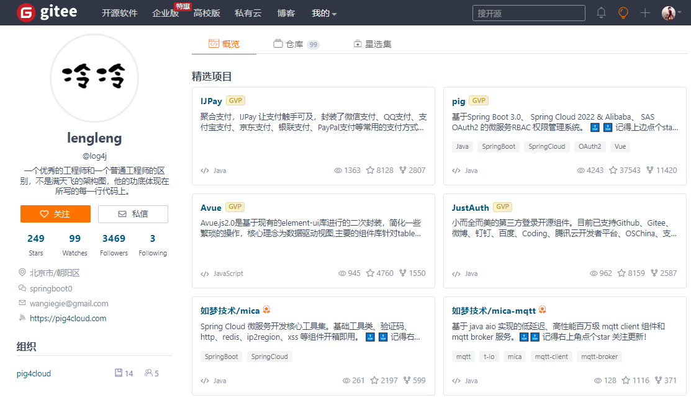
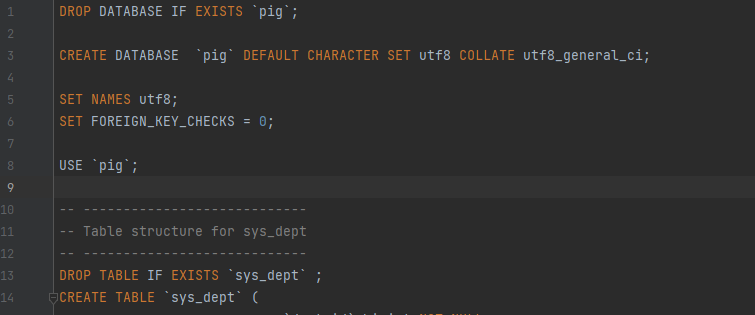
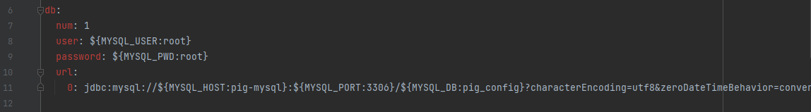
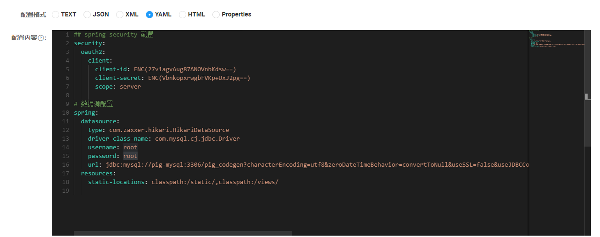
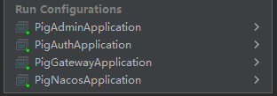
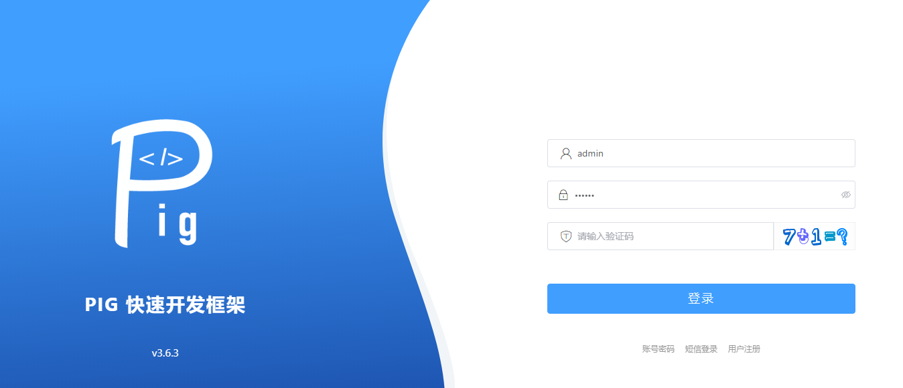
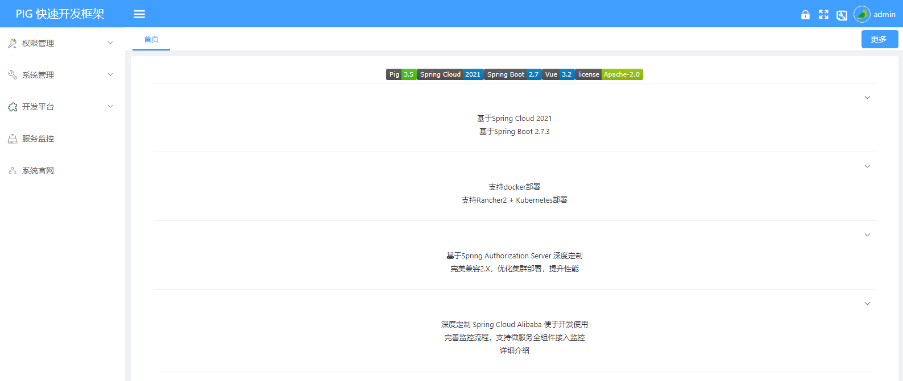

在上一系列，对 RuoYi（若依）的单体项目比较简单地进行了探秘。虽然 RuoYi 的单体项目有很多不足，但是瑕不掩瑜，RuoYi 还是一个在小项目、验证项目、紧急项目时，可用的基础框架项目。本系列将会品鉴一个更有意思的项目：`pig`。

<!-- more -->

## 项目介绍

`pig` 项目分为前端项目和后端项目，在 `Gitee` 和 `GitHub` 上都有维护，项目地址如下：

|平台|项目|地址|
|--|--|--|
|Gitee|前端|[https://gitee.com/log4j/pig-ui](https://gitee.com/log4j/pig-ui)|
|GitHub|前端|[https://github.com/pig-mesh/pig-ui](https://github.com/pig-mesh/pig-ui)|
|Gitee|后端|[https://gitee.com/log4j/pig](https://gitee.com/log4j/pig)|
|GitHub|后端|[https://github.com/pig-mesh/pig](https://github.com/pig-mesh/pig)|

我们与 RuoYi 对比一下 `Star`、`Fork` 和 `Watch`，由于 pig 是前后端分离的两个独立项目，所以我们也进一步对比一下 RuoYi 的前后端分离的单体项目。

截止 2023.01.09，对比数据如下表：

|平台|项目|Star|Fork|Watch|
|--|--|--|--|--|
|Gitee|RuoYi|34.1K|18.2K|5.3K|
|Gitee|RuoYi-Vue|24.1K|16.4K|2.6K|
|Gitee|pig-ui|2.2K|3.6K|384|
|Gitee|pig|37.5K|11.4K|4.2K|
|GitHub|RuoYi|3.4K|1.1K|68|
|GitHub|RuoYi-Vue|1.4K|860|31|
|GitHub|pig-ui|139|135|13|
|GitHub|pig|4.3K|685|81|

从对比表中可以看到，在数据上 pig 有略微更高一些的热度，而且我们可以从作者主页看到，pig 项目的作者还有很多其他的 Gitee `GVP` 项目，项目涉及范围更广。

## 看外观

一头好吃的猪，一定有一个漂亮的外观。我们先看看这头 pig 到底长得怎么样。

在文章[开源界的卷王](https://juejin.cn/post/7156074566677168136)中的项目推荐中，我们可以看到 pig 的推荐理由如下：

:::tip 引用

推荐理由

1.【作者】一位专注开源界的大佬，仓库中有多个 GVP 项目证明了他的实力，该项目也在 Gitee 上登顶

2.【文档】文档、教学视频丰富，不少关键环节进行了细致的文档讲解，甚至提供了常见问题总结的 FAQ，文档地址

3.【运维】Docker 部署，一键部署作者都提供了解决方案

4.【整合能力】与优秀的开源产品的融合度很高，提供了 jfinal、Ruoyi、Guns、renren、jeesite 等优秀框架的接入

5.【分布式】由于项目采用微服务架构，结合文档你可以深入的体会服务注册、网关、负载均衡、限流、熔断、链路追踪、缓存、分布式事务等功能，让没有使用场景的同学背八股文的时候理解的更深刻。

6.【代码】代码遵循《Alibaba Java 开发手册》（这条看着简单，但是其实很难，很多项目都是乱写的）

7.【项目依赖】核心依赖的版本一直与时俱进，采用核心组件的版本非常新，没有使用明显的具有漏洞的依赖

8.【前端】已支持 Vue3，项目使用的 element-ui 也是在 Vue 领域应用最广泛的前端组件库
:::

以上这些推荐点中，我们可以看到，pig 项目不仅代码非常规范，使用了微服务架构，甚至还能与 RuoYi 结合使用，扩展性还是很强的。

下面我们以 pig 的主线分支进行分析。

我们先用 `coding.net` 对后端代码进行扫描，结果如下：

整体评分略低于 RuoYi，警告问题远远小于 RuoYi，但提示问题比 RuoYi 多了一个数量级。其中，大量问题也是代码细节风格问题，但不像 RuoYi 使用的 C# 风格，pig 的风格还是 Java 的。

使用 IDEA 打开后端项目以后，目录结构如下图：

其中，`db` 目录包含数据库脚本以及 Docker 文件。

子项目目录为：

- `pig-auth`：认证子项目。
- `pig-common`：为项目相关的通用组件的子项目，包括 `pig-common-bom`、`pig-common-core`、`pig-common-datasource`等。
- `pig-gateway`：网关子项目。
- `pig-register`：服务注册子项目（Nacos）。
- `pig-upms`：管理系统子项目，包括 `pig-upms-api`、`pig-upms-biz`。
- `pig-visual`：附加的一些可视化子项目，包括 `pig-codegen`（代码生成）、`pig-monitor`（监控）、`pig-sentinel-dashboard`（sentinel 大屏）、`pig-xxl-job-admin`（xxl-job 定时任务）。

从以上概览可以看出来，pig 作为后端项目，不是一个独立的单体应用，而是多个微服务共同组成的。

前端项目初看一下，可以看到 `docker` 目录，里面也有 `Dockerfile`，说明 pig-ui 也是官方支持直接做成容器。由于我对前端涉猎不深，对 pig-ui 不作分析。

pig 项目的介绍中，我们知道项目使用了 `Spring Boot`、`Spring Cloud`、`Spring Security` 等框架，后端拆分为了多个微服务，还提供了容器化支持。也就是说，通过这一个项目，我们就可以了解三个事情：基础框架项目的搭建运行、微服务的拆分运行、容器化的部署运行。这就是通过 pig 这头猪，我们可以学到三方面的知识，这就是“一猪三吃”。

## 运行后端

我们先按官方文档，配置好运行依赖的环境，包括 `JDK`、`Redis`、`MySQL` 和 `Node.js` 等。

我们接着初始化相关的数据库，sql 文件存放于 `db` 文件夹中，我们随意打开一个文件 `pig.sql`，如下图：

我们可以看到，pig 的 sql 文件中，建数据库和建数据表都采用了存在性判定，并且所有 sql 关键字都使用了大写风格，非常专业。

然后，我们按文档配置注册中心项目 `pig-register` 的数据库连接，配置文件示例如下图：

可以看到，配置文件中使用了标准的“环境变量+默认值”的形式进行配置，点个赞，专业的看起来就是让人很舒服。我们不直接修改默认值，而是在相应的项目启动项中使用环境变量配置本地环境信息。

启动项目 `pig-register` 后，再按文档，在注册中心中，将 MySQL、Redis 等环境信息配置到相应的配置文件中。如下图：

最后，按官方文档依次运行主要项目，IDEA 中的运行项目如下图所示：

## 运行前端

后端项目运行成功后，我们再按官方文档运行前端项目。按文档使用 `npm` 运行项目即可。

最终运行成功后，访问 `http://localhost:8080`，可以看到如下界面：

## 看界面

前后端项目运行成功后，我们使用默认用户名 `admin` 和 `123456` 登录进入系统，如下图：

可以看到，pig 的整体界面非常简洁，或者说有点丑，但是像 RuoYi 一样，如果只是用于后台管理系统，也是足够用的。

菜单项，同样的选择布局在左侧，这是现在比较常见的布局方式，我们看一下菜单结构，大体如下：

顶级菜单包括：

- 权限管理
- 系统管理
- 开发平台
- 服务监控
- 系统官网

`权限管理`包括如下子菜单：

- 用户管理
- 菜单管理
- 角色管理
- 部门管理
- 岗位管理

`权限管理`中主要是针对 RBAC 的管理功能，是一个系统最核心也最不可缺少的一部分。基本涵盖的还是用户——组织——角色三驾马车，可能还有像 pig 中的非后台必要功能的“岗位管理”这类偏业务的功能。

`系统管理`包括如下子菜单：

- 终端管理
- 文件管理
- 字典管理
- 日志管理
- 令牌管理
- 参数管理

`开发平台`包括如下子菜单：

- 代码生成
- 表单管理
- 表单设计
- 数据源管理

开发平台整个功能依赖于项目 `pig-codegen`，也就是代码生成项目，如果没有运行代码生成项目，开发平台相关功能是不可用的。

剩下的“服务监控”一级菜单，直接对接的就是 `pig-monitor` 监控项目，如果没有运行项目，相关界面直接无法打开。

界面整体设计上，右上角的部分可点击按钮，指向时是没有超链接的图标，这个在前端交互设计上是有问题的，需要改进。

而针对菜单来说，由于整个系统设计上是微服务架构，不同部分的菜单对应的可能是不同的服务，按当前这个情况看，如果部分服务没有运行，菜单功能就是不可用的。针对这个问题，如果整体系统膨胀，功能更多了，我们一般会有两种设计选择。

一种设计是，当后端服务不可用时，由前端给出提示，如“某服务不可用”，而不是像当前设计一样直接将 “503” 异常在前端展示；

另一种设计是，实现一个菜单注册机制，不同服务初始化部署时，会向注册中心注册菜单数据，前端通过一个菜单接口获取当前可用的菜单项。

两种设计有各自的适用方向，有时甚至还会结合使用。特别是当微服务化下，后端服务和前端服务由多个开发部门或开发组进行时，采用一种设计来保证界面一致性是非常必要的。但就当前示例界面来说，项目在一定规模以下，是不用考虑这个问题的，毕竟项目开发的本质是一个项目成本核算的工程。

## 小结

本篇，我们初步接触了 pig 项目的前后端，了解到 pig 可以让我们“一猪三吃”，并且初步运行起来了项目，看了下这只漂亮的猪长什么样。

pig 项目的代码我们还没有查看，但就从 sql 文件的风格来说，可重复执行性、关键字大写这些，非常专业，值得初学者或者需要提升的人学习。

下一篇，将展开对各模块的解构，本篇就到这里，比心，❤。
