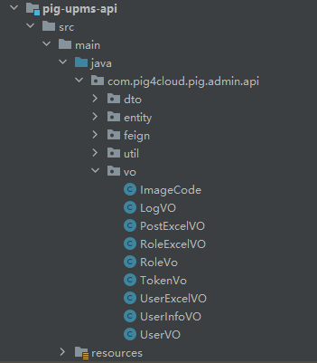
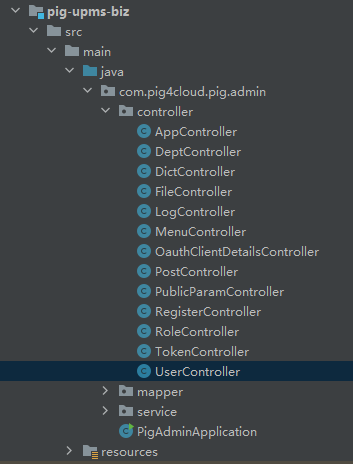
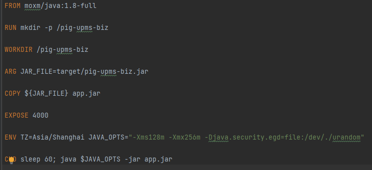

上一篇中，我们概览一下 pig 项目的整体结构，并将其运行起来了。本篇我们进一步分析一下各子项目。

## pig-visual

`pig-visual` 附加的一些可视化子项目，包括 `pig-codegen`（代码生成）、`pig-monitor`（监控）、`pig-sentinel-dashboard`（sentinel 大屏）、`pig-xxl-job-admin`（xxl-job 定时任务）。

### pig-codegen

`pig-codegen` 作为代码生成模块，使用 Apache Velocity 作为引擎。Apache Velocity 是一个基于 Java 的模板引擎，它提供了一个模板语言去引用由 Java 代码定义的对象，可基于模板生成 Java、SQL 或 PostScript 源代码。

### pig-monitor

`pig-monitor` 作为监控项目，基于 `spring-boot-admin` 实现，开源项目地址为 https://github.com/codecentric/spring-boot-admin 。`pig-monitor` 中除了配置了服务注册和认证跳转，没有进行任何开发工作。

### pig-sentinel-dashboard

`pig-sentinel-dashboard` 作为 sentinel 大屏，用于实现监控大屏，核心基于 sentinel，开源项目地址为 https://github.com/alibaba/Sentinel 。整个项目虽然作为监控大屏，非核心特性，整个代码实现还是比较整洁，但作为一个开源项目，没有任何注释，如果没有文档配合，几乎 不知道实现了什么业务，非常不应该。

### pig-xxl-job-admin

`pig-xxl-job-admin` 作为定时任务，基于 `xxl-job-admin` 实现，开源项目地址为 https://github.com/xuxueli/xxl-job 。`xxl-job` 作为国产开源定时任务框架，功能非常丰富且易用，扩展性和修改性都比较好。

`pig-xxl-job-admin` 项目整个都是复制的 `xxl-job` 项目中的 `xxl-job-admin`。我不禁打出一个大大的问号，这是为了个啥？

`pig-monitor` 至少还调整了一些 `spring-boot-admin` 以便更方便的服务注册和跳转到认证，`pig-xxl-job-admin` 百分之百复刻 `xxl-job-admin` 就真的看不懂了。

## pig-register

`pig-register` 是服务注册项目，基于 `nacos` 实现，开源项目地址为 https://github.com/alibaba/nacos 。 `nacos` 提供微服务发现、配置和管理。`pig-register` 也几乎是百分之一百复刻 `nacos`。

## pig-gateway

`pig-gateway` 作为网关服务，基于 Spring Cloud Gateway 实现，开源项目地址为 https://github.com/spring-cloud/spring-cloud-gateway 。 Spring Cloud Gateway 作为网关项目，核心功能就提供了服务的路由。`pig-gateway` 中主要增加了一些过滤器和异常处理。

## pig-common

`pig-common` 作为项目的通用基础组件，包括 `pig-common-bom`、`pig-common-core`、`pig-common-datasource` 等多个子项目。

`pig-common-bom` 打包类型为 `pom`，用于定义依赖项的版本号，用于统一版本管理。

`pig-common-core` 作为工具类核心，使用了开源项目 `hutool`，并引用了 Spring Boot 的 validator 和 json。项目中提供了用的 Jackson、RedisTemplate、RestTemplate 的工厂 Bean 声明，然后设置了了 TaskExecutor 的线程池相关配置，实现了 WebMvcConfigurer 用于指定日期的格式化方法和国际化配置。另外还提供了一些常用的常量值以及工具类方法。

类似的 `*-datasource` 是数据库相关的配置及自定义的动态数据源注解的实现，`*-feign` 是 feign 相关的配置以及自定义的启用 feign client 的注解，`*-job` 则是 xxl-job 相关的配置以及自定义的启用 xxl-job 的注解，`*-log` 是 AOP 实现的日志记录以及自定义的日志注解，`*-mybatis` 是 MyBatis 和 MyBatis Plus 相关的配置以及一些自定义解析器，`*-seata` 是 alibaba seata 的分页式事务的自动配置，`*-security` 提供的是 OAuth2.0 相关的配置及实现代码，主要依赖于 Spring Cloud 的 OAuth Server，`*-swagger` 则提供 Swagger 相关的配置，Swagger 可以提供 Open API 相关的 API 展示及操作，`*-xss` 基于 jsoup，用于对 http 传递的数据进行一些安全过滤。

通过以上的简要速览，可知 common 项目拆得很散，这种拆分方法虽然高内聚，但个人认为在这种本质是单体应用的项目中有点多余，将其作为一个整体项目，以包名进行区分，一样的清晰。如果就是想提供专门的自动配置组件，不如把这种单独的项目并发布到 Maven 中央库作为公开依赖，而不是作为 pig 项目的一部分发布。

## pig-auth

`pig-auth` 作为最核心的子项目，提供认证相关功能以及启动项目。

## pig-upms

`pig-upms` 作为管理系统子项目，包括 `pig-upms-api`、`pig-upms-biz`，项目相关的业务实现都在此。`pig-upms-api` 中主要是一些 VO 的定义，`pig-upms-biz` 则是控制器和服务层面的实现。如下图：

相关的业务不做进一步分析。

## 容器化

`pig` 项目中每个需要提供对外服务的子项目都带有 Dockerfile，类似下图：

结合我们在之前 `pom.xml` 中看到配置了 Docker 插件 `io.fabric8:docker-maven-plugin`，我们可知项目目的是想编译时构建 Docker 镜像 。文件中配置的基础镜像为 `moxm/java:1.8-full`，理论上一般我们会更倾向于选择 OpenJDK 的镜像。

## 小结

pig 项目最大的优点，比如代码风格优良，拆分微服务，并提供 Dockerfile 用于容器化部署，这些值得我们学习，更多的代码细节不再展开。

但是 pig 项目中引入了大量其他服务。虽然这些服务作为微服务运行环境的一部分，但是不建议和我们自己的框架混合在一起，这么多项目混在一起，还是挺唬人的，实际剖析一看，除了自己的三两个项目，全是开源的其他项目。

如果我们的项目是作为微服务运行，需要微服务注册、配置相关的依赖项，可以在文档中说明环境配置，而不是在自己的项目中引用这些项目；而如果真的需要订制其他项目，也应该单独的项目提供，而不是作为一个项目的子项目提供。

而 pig 项目还提供二次开发的在线工具和文档指导，这一点是值得称道和有益的。

pig 项目的解析就比较仓促的暂时到此。后面将主要进行 micronaut 框架的实践应用，有兴趣的可以看看还在翻译中的 Micronaut 的文档，地址：https://micronaut.bookhub.tech/ ，有兴趣的可以看看或者一起参与。
