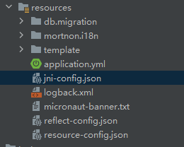

当我们不论使用 Micronaut 框架还是其他框架时，如果项目中使用了 AWT 相应特性（仅特性，非 Swing 应用），比如生成图片，在我们将 Java 应用编译为 Native Image 本地应用后，可能就会报出很多和 AWT 相关的异常，导致生成图片相关功能无法使用。

Quarkus 框架给出了官方的解决方案，直接按官方方案使用插件和制作基础镜像即可。

本文将给出一个 Micornaut 框架的完整的指南和项目示例，说明如何配置可以正确正确编译出支持 AWT 特性的项目。

<!-- more -->

## 1. 基础镜像准备

Micronaut 框架的默认编译插件中，如 Maven Plugin，指定的 Docker 基础镜像为：`frolvlad/alpine-glibc:alpine-3.XX`。该镜像中没有图形化所依赖的包 `freetype`，理论上为该镜像安装依赖的包即可。安装命令如下：

```bash
apk add freetype
```

但以 Micronaut 3.10.3 对应的基础镜像版本 `alpine-3.19` 为例，安装 `freetype` 后，连带依赖 `brotli-libs` 却无法正常运行，此问题我一直无法找到解决方法，最后我决定换一个其他的镜像作为运行基础镜像。

最终验证多种镜像后，推荐两个我觉得不错的镜像，一个是最全的镜像：`centos` ，缺点是镜像比较大，约 204M；另一个是：`redhat/ubi8-minimal`，大小约 93M，本次选用了它。

我们基于此镜像，安装图形化相关的依赖包，制作运行基础镜像，Dockerfile 示例如下：

```bash
FROM redhat/ubi8-minimal:8.9
RUN microdnf install freetype fontconfig
```

## 2. Native Image 镜像准备

由于 Micronaut 插件使用 Dockerfile 多步编译制作镜像，依赖安装有 GraalVM Native Image 命令的 Docker 镜像进行编译，所以我们先准备编译用镜像：`ghcr.io/graalvm/native-image:ol7-java11-22.3.2`。

> 注意：此处的镜像版本是使用 Micronaut 3.10.3 所对应的。具体的版本会由于 Micronaut 框架版本的差异而有差异，可以使用命令 `mvn mn:dockerfile -Dpackagin=docker-native` 生成 Dockerfile，然后查看其中的镜像版本。

由于国内的 Docker 镜像仓库代理，都只代理的 Docker Hub，而 Graal 的镜像分发在 `ghcr.io`，如果你没有合规的 VPN 途径，是无法下载到此镜像的。

推荐通过 GitHub 项目 [hub-mirror](https://github.com/togettoyou/hub-mirror) 将镜像转换拉取到你的的阿里云个人仓库中，再拉取到本地即可。

如果你连 GitHub 都上不去了，就先装一个 [Watt Toolkit](https://steampp.net/)。

由于我们的项目依赖 AWT 图形组件，所以编译环境也需要相应的图形组件，我们先给 `graalvm/native-image` 安装 `freetype` 库：

```bash
FROM ghcr.io/graalvm/native-image:ol7-java11-22.3.2
RUN yum install -y freetype-devel
```

制作好镜像后，我们将原版镜像备份，如： `docker tag ghcr.io/graalvm/native-image:ol7-java11-22.3.2 native:back`，然后将的镜像改为原版的 tag 以替换原镜像。

## 3.项目配置文件准备

我们的目标是要编译得到一个本地应用，按照 GraalVM 的官方指南，我们需要**将类的信息添加到配置文件中，以支持反射查找类**，然后在编译时指定该文件。这样在编译后，本地应用就不会报错找不到类了。

按照以上官方的指南思路进行配置，我们也不用手工去编写这个文件。我们只要先使用 `mvn package` 命令编译出 jar，然后我们在本地（非 Docker 中）安装 GraalVM 作为 JDK，接着使用 java 命令，带着 agent 运行 jar，在运行后执行相应的业务逻辑，代码所涉及反射的类信息，就会自动添加到指定的配置文件中。

运行代理的代码示例如下：

```bash
java -agentlib:native-image-agent=config-output-dir=./output -jar mortnon-micronaut-0.1.jar
```

以上代码中我们指定输出目录为当前目录下的 `output`。

如上运行后，我们要解决 AWT 图形化相关的编译问题，只要调用生成图片相关的 API 触发相应的逻辑，对应的 AWT 的反射信息就会自动添加到配置文件中。

在我们停止运行后，在 `output` 目录中就可以找到生成的配置文件。

> 如果需要生成整个项目的反射信息，我们遍历所有的业务逻辑。但我更推荐按需要添加，缺少再加。

最终生成的文件，我们主要需要三个： `jni-config.json`、`reflect-config.json` 和 `resource-config.json`。

AWT 由于通过 JNI 调用原生 API 进行图形操作，所以还会涉及到 JNI 的配置文件。

虽然官方的组件自动生成了这些文件，但最终编译为 Native Image 运行时，还是可能会有部分类信息未添加到配置文件中。比如报错： `java.awt.AWTError: Toolkit not found: sun.awt.X11.XToolkit`，就是没有自动识别到的类，这里需要我们手动添加到配置文件中后重新编译。

以我的项目为例，使用了 AWT 生成图片，最终一个可用的、包含有 AWT 的配置文件内容示例如下：

- `jni-config.json`

```bash
[
  {
    "name": "[Lsun.java2d.loops.GraphicsPrimitive;"
  },
  {
    "name": "java.awt.AlphaComposite",
    "fields": [
      {
        "name": "extraAlpha"
      },
      {
        "name": "rule"
      }
    ]
  },
  {
    "name": "java.awt.Color",
    "methods": [
      {
        "name": "getRGB",
        "parameterTypes": []
      }
    ]
  },
  {
    "name": "java.awt.GraphicsEnvironment",
    "methods": [
      {
        "name": "isHeadless",
        "parameterTypes": []
      }
    ]
  },
  {
    "name": "java.awt.geom.AffineTransform",
    "fields": [
      {
        "name": "m00"
      },
      {
        "name": "m01"
      },
      {
        "name": "m02"
      },
      {
        "name": "m10"
      },
      {
        "name": "m11"
      },
      {
        "name": "m12"
      }
    ]
  },
  {
    "name": "java.awt.geom.GeneralPath",
    "methods": [
      {
        "name": "<init>",
        "parameterTypes": []
      },
      {
        "name": "<init>",
        "parameterTypes": [
          "int",
          "byte[]",
          "int",
          "float[]",
          "int"
        ]
      }
    ]
  },
  {
    "name": "java.awt.geom.Path2D",
    "fields": [
      {
        "name": "numTypes"
      },
      {
        "name": "pointTypes"
      },
      {
        "name": "windingRule"
      }
    ]
  },
  {
    "name": "java.awt.geom.Path2D$Float",
    "fields": [
      {
        "name": "floatCoords"
      }
    ]
  },
  {
    "name": "java.awt.geom.Point2D$Float",
    "fields": [
      {
        "name": "x"
      },
      {
        "name": "y"
      }
    ],
    "methods": [
      {
        "name": "<init>",
        "parameterTypes": [
          "float",
          "float"
        ]
      }
    ]
  },
  {
    "name": "java.awt.geom.Rectangle2D$Float",
    "fields": [
      {
        "name": "height"
      },
      {
        "name": "width"
      },
      {
        "name": "x"
      },
      {
        "name": "y"
      }
    ],
    "methods": [
      {
        "name": "<init>",
        "parameterTypes": []
      },
      {
        "name": "<init>",
        "parameterTypes": [
          "float",
          "float",
          "float",
          "float"
        ]
      }
    ]
  },
  {
    "name": "java.awt.image.BufferedImage",
    "fields": [
      {
        "name": "colorModel"
      },
      {
        "name": "imageType"
      },
      {
        "name": "raster"
      }
    ],
    "methods": [
      {
        "name": "getRGB",
        "parameterTypes": [
          "int",
          "int",
          "int",
          "int",
          "int[]",
          "int",
          "int"
        ]
      },
      {
        "name": "setRGB",
        "parameterTypes": [
          "int",
          "int",
          "int",
          "int",
          "int[]",
          "int",
          "int"
        ]
      }
    ]
  },
  {
    "name": "java.awt.image.ColorModel",
    "fields": [
      {
        "name": "colorSpace"
      },
      {
        "name": "colorSpaceType"
      },
      {
        "name": "isAlphaPremultiplied"
      },
      {
        "name": "is_sRGB"
      },
      {
        "name": "nBits"
      },
      {
        "name": "numComponents"
      },
      {
        "name": "pData"
      },
      {
        "name": "supportsAlpha"
      },
      {
        "name": "transparency"
      }
    ],
    "methods": [
      {
        "name": "getRGBdefault",
        "parameterTypes": []
      }
    ]
  },
  {
    "name": "java.awt.image.IndexColorModel",
    "fields": [
      {
        "name": "allgrayopaque"
      },
      {
        "name": "colorData"
      },
      {
        "name": "map_size"
      },
      {
        "name": "rgb"
      },
      {
        "name": "transparent_index"
      }
    ]
  },
  {
    "name": "java.awt.image.Raster",
    "fields": [
      {
        "name": "dataBuffer"
      },
      {
        "name": "height"
      },
      {
        "name": "minX"
      },
      {
        "name": "minY"
      },
      {
        "name": "numBands"
      },
      {
        "name": "numDataElements"
      },
      {
        "name": "sampleModel"
      },
      {
        "name": "sampleModelTranslateX"
      },
      {
        "name": "sampleModelTranslateY"
      },
      {
        "name": "width"
      }
    ]
  },
  {
    "name": "java.awt.image.SampleModel",
    "fields": [
      {
        "name": "height"
      },
      {
        "name": "width"
      }
    ],
    "methods": [
      {
        "name": "getPixels",
        "parameterTypes": [
          "int",
          "int",
          "int",
          "int",
          "int[]",
          "java.awt.image.DataBuffer"
        ]
      },
      {
        "name": "setPixels",
        "parameterTypes": [
          "int",
          "int",
          "int",
          "int",
          "int[]",
          "java.awt.image.DataBuffer"
        ]
      }
    ]
  },
  {
    "name": "java.awt.image.SinglePixelPackedSampleModel",
    "fields": [
      {
        "name": "bitMasks"
      },
      {
        "name": "bitOffsets"
      },
      {
        "name": "bitSizes"
      },
      {
        "name": "maxBitSize"
      }
    ]
  },
  {
    "name": "sun.awt.SunHints",
    "fields": [
      {
        "name": "INTVAL_STROKE_PURE"
      }
    ]
  },
  {
    "name": "sun.awt.image.BufImgSurfaceData$ICMColorData",
    "fields": [
      {
        "name": "pData"
      }
    ],
    "methods": [
      {
        "name": "<init>",
        "parameterTypes": [
          "long"
        ]
      }
    ]
  },
  {
    "name": "sun.awt.image.IntegerComponentRaster",
    "fields": [
      {
        "name": "data"
      },
      {
        "name": "dataOffsets"
      },
      {
        "name": "pixelStride"
      },
      {
        "name": "scanlineStride"
      },
      {
        "name": "type"
      }
    ]
  },
  {
    "name": "sun.font.CharToGlyphMapper",
    "methods": [
      {
        "name": "charToGlyph",
        "parameterTypes": [
          "int"
        ]
      }
    ]
  },
  {
    "name": "sun.font.Font2D",
    "methods": [
      {
        "name": "canDisplay",
        "parameterTypes": [
          "char"
        ]
      },
      {
        "name": "charToGlyph",
        "parameterTypes": [
          "int"
        ]
      },
      {
        "name": "charToVariationGlyph",
        "parameterTypes": [
          "int",
          "int"
        ]
      },
      {
        "name": "getMapper",
        "parameterTypes": []
      },
      {
        "name": "getTableBytes",
        "parameterTypes": [
          "int"
        ]
      }
    ]
  },
  {
    "name": "sun.font.FontStrike",
    "methods": [
      {
        "name": "getGlyphMetrics",
        "parameterTypes": [
          "int"
        ]
      }
    ]
  },
  {
    "name": "sun.font.FreetypeFontScaler",
    "methods": [
      {
        "name": "invalidateScaler",
        "parameterTypes": []
      }
    ]
  },
  {
    "name": "sun.font.GlyphList",
    "fields": [
      {
        "name": "len"
      },
      {
        "name": "maxLen"
      },
      {
        "name": "maxPosLen"
      },
      {
        "name": "glyphData"
      },
      {
        "name": "chData"
      },
      {
        "name": "images"
      },
      {
        "name": "positions"
      },
      {
        "name": "x"
      },
      {
        "name": "y"
      },
      {
        "name": "gposx"
      },
      {
        "name": "gposy"
      },
      {
        "name": "usePositions"
      },
      {
        "name": "lcdRGBOrder"
      },
      {
        "name": "lcdSubPixPos"
      }
    ]
  },
  {
    "name": "sun.font.PhysicalStrike",
    "fields": [
      {
        "name": "pScalerContext"
      }
    ],
    "methods": [
      {
        "name": "adjustPoint",
        "parameterTypes": [
          "java.awt.geom.Point2D$Float"
        ]
      },
      {
        "name": "getGlyphPoint",
        "parameterTypes": [
          "int",
          "int"
        ]
      }
    ]
  },
  {
    "name": "sun.font.StrikeMetrics",
    "methods": [
      {
        "name": "<init>",
        "parameterTypes": [
          "float",
          "float",
          "float",
          "float",
          "float",
          "float",
          "float",
          "float",
          "float",
          "float"
        ]
      }
    ]
  },
  {
    "name": "sun.font.TrueTypeFont",
    "methods": [
      {
        "name": "readBlock",
        "parameterTypes": [
          "java.nio.ByteBuffer",
          "int",
          "int"
        ]
      },
      {
        "name": "readBytes",
        "parameterTypes": [
          "int",
          "int"
        ]
      }
    ]
  },
  {
    "name": "sun.font.Type1Font",
    "methods": [
      {
        "name": "readFile",
        "parameterTypes": [
          "java.nio.ByteBuffer"
        ]
      }
    ]
  },
  {
    "name": "sun.java2d.Disposer",
    "methods": [
      {
        "name": "addRecord",
        "parameterTypes": [
          "java.lang.Object",
          "long",
          "long"
        ]
      }
    ]
  },
  {
    "name": "sun.java2d.InvalidPipeException"
  },
  {
    "name": "sun.java2d.NullSurfaceData"
  },
  {
    "name": "sun.java2d.SunGraphics2D",
    "fields": [
      {
        "name": "clipRegion"
      },
      {
        "name": "composite"
      },
      {
        "name": "eargb"
      },
      {
        "name": "lcdTextContrast"
      },
      {
        "name": "pixel"
      },
      {
        "name": "strokeHint"
      }
    ]
  },
  {
    "name": "sun.java2d.SurfaceData",
    "fields": [
      {
        "name": "pData"
      },
      {
        "name": "valid"
      }
    ]
  },
  {
    "name": "sun.java2d.loops.Blit",
    "methods": [
      {
        "name": "<init>",
        "parameterTypes": [
          "long",
          "sun.java2d.loops.SurfaceType",
          "sun.java2d.loops.CompositeType",
          "sun.java2d.loops.SurfaceType"
        ]
      }
    ]
  },
  {
    "name": "sun.java2d.loops.BlitBg",
    "methods": [
      {
        "name": "<init>",
        "parameterTypes": [
          "long",
          "sun.java2d.loops.SurfaceType",
          "sun.java2d.loops.CompositeType",
          "sun.java2d.loops.SurfaceType"
        ]
      }
    ]
  },
  {
    "name": "sun.java2d.loops.CompositeType",
    "fields": [
      {
        "name": "AnyAlpha"
      },
      {
        "name": "Src"
      },
      {
        "name": "SrcNoEa"
      },
      {
        "name": "SrcOver"
      },
      {
        "name": "SrcOverNoEa"
      },
      {
        "name": "Xor"
      }
    ]
  },
  {
    "name": "sun.java2d.loops.DrawGlyphList",
    "methods": [
      {
        "name": "<init>",
        "parameterTypes": [
          "long",
          "sun.java2d.loops.SurfaceType",
          "sun.java2d.loops.CompositeType",
          "sun.java2d.loops.SurfaceType"
        ]
      }
    ]
  },
  {
    "name": "sun.java2d.loops.DrawGlyphListAA",
    "methods": [
      {
        "name": "<init>",
        "parameterTypes": [
          "long",
          "sun.java2d.loops.SurfaceType",
          "sun.java2d.loops.CompositeType",
          "sun.java2d.loops.SurfaceType"
        ]
      }
    ]
  },
  {
    "name": "sun.java2d.loops.DrawGlyphListLCD",
    "methods": [
      {
        "name": "<init>",
        "parameterTypes": [
          "long",
          "sun.java2d.loops.SurfaceType",
          "sun.java2d.loops.CompositeType",
          "sun.java2d.loops.SurfaceType"
        ]
      }
    ]
  },
  {
    "name": "sun.java2d.loops.DrawLine",
    "methods": [
      {
        "name": "<init>",
        "parameterTypes": [
          "long",
          "sun.java2d.loops.SurfaceType",
          "sun.java2d.loops.CompositeType",
          "sun.java2d.loops.SurfaceType"
        ]
      }
    ]
  },
  {
    "name": "sun.java2d.loops.DrawParallelogram",
    "methods": [
      {
        "name": "<init>",
        "parameterTypes": [
          "long",
          "sun.java2d.loops.SurfaceType",
          "sun.java2d.loops.CompositeType",
          "sun.java2d.loops.SurfaceType"
        ]
      }
    ]
  },
  {
    "name": "sun.java2d.loops.DrawPath",
    "methods": [
      {
        "name": "<init>",
        "parameterTypes": [
          "long",
          "sun.java2d.loops.SurfaceType",
          "sun.java2d.loops.CompositeType",
          "sun.java2d.loops.SurfaceType"
        ]
      }
    ]
  },
  {
    "name": "sun.java2d.loops.DrawPolygons",
    "methods": [
      {
        "name": "<init>",
        "parameterTypes": [
          "long",
          "sun.java2d.loops.SurfaceType",
          "sun.java2d.loops.CompositeType",
          "sun.java2d.loops.SurfaceType"
        ]
      }
    ]
  },
  {
    "name": "sun.java2d.loops.DrawRect",
    "methods": [
      {
        "name": "<init>",
        "parameterTypes": [
          "long",
          "sun.java2d.loops.SurfaceType",
          "sun.java2d.loops.CompositeType",
          "sun.java2d.loops.SurfaceType"
        ]
      }
    ]
  },
  {
    "name": "sun.java2d.loops.FillParallelogram",
    "methods": [
      {
        "name": "<init>",
        "parameterTypes": [
          "long",
          "sun.java2d.loops.SurfaceType",
          "sun.java2d.loops.CompositeType",
          "sun.java2d.loops.SurfaceType"
        ]
      }
    ]
  },
  {
    "name": "sun.java2d.loops.FillPath",
    "methods": [
      {
        "name": "<init>",
        "parameterTypes": [
          "long",
          "sun.java2d.loops.SurfaceType",
          "sun.java2d.loops.CompositeType",
          "sun.java2d.loops.SurfaceType"
        ]
      }
    ]
  },
  {
    "name": "sun.java2d.loops.FillRect",
    "methods": [
      {
        "name": "<init>",
        "parameterTypes": [
          "long",
          "sun.java2d.loops.SurfaceType",
          "sun.java2d.loops.CompositeType",
          "sun.java2d.loops.SurfaceType"
        ]
      }
    ]
  },
  {
    "name": "sun.java2d.loops.FillSpans",
    "methods": [
      {
        "name": "<init>",
        "parameterTypes": [
          "long",
          "sun.java2d.loops.SurfaceType",
          "sun.java2d.loops.CompositeType",
          "sun.java2d.loops.SurfaceType"
        ]
      }
    ]
  },
  {
    "name": "sun.java2d.loops.GraphicsPrimitive",
    "fields": [
      {
        "name": "pNativePrim"
      }
    ]
  },
  {
    "name": "sun.java2d.loops.GraphicsPrimitiveMgr",
    "methods": [
      {
        "name": "register",
        "parameterTypes": [
          "sun.java2d.loops.GraphicsPrimitive[]"
        ]
      }
    ]
  },
  {
    "name": "sun.java2d.loops.MaskBlit",
    "methods": [
      {
        "name": "<init>",
        "parameterTypes": [
          "long",
          "sun.java2d.loops.SurfaceType",
          "sun.java2d.loops.CompositeType",
          "sun.java2d.loops.SurfaceType"
        ]
      }
    ]
  },
  {
    "name": "sun.java2d.loops.MaskFill",
    "methods": [
      {
        "name": "<init>",
        "parameterTypes": [
          "long",
          "sun.java2d.loops.SurfaceType",
          "sun.java2d.loops.CompositeType",
          "sun.java2d.loops.SurfaceType"
        ]
      }
    ]
  },
  {
    "name": "sun.java2d.loops.ScaledBlit",
    "methods": [
      {
        "name": "<init>",
        "parameterTypes": [
          "long",
          "sun.java2d.loops.SurfaceType",
          "sun.java2d.loops.CompositeType",
          "sun.java2d.loops.SurfaceType"
        ]
      }
    ]
  },
  {
    "name": "sun.java2d.loops.SurfaceType",
    "fields": [
      {
        "name": "Any3Byte"
      },
      {
        "name": "Any4Byte"
      },
      {
        "name": "AnyByte"
      },
      {
        "name": "AnyColor"
      },
      {
        "name": "AnyInt"
      },
      {
        "name": "AnyShort"
      },
      {
        "name": "ByteBinary1Bit"
      },
      {
        "name": "ByteBinary2Bit"
      },
      {
        "name": "ByteBinary4Bit"
      },
      {
        "name": "ByteGray"
      },
      {
        "name": "ByteIndexed"
      },
      {
        "name": "ByteIndexedBm"
      },
      {
        "name": "FourByteAbgr"
      },
      {
        "name": "FourByteAbgrPre"
      },
      {
        "name": "Index12Gray"
      },
      {
        "name": "Index8Gray"
      },
      {
        "name": "IntArgb"
      },
      {
        "name": "IntArgbBm"
      },
      {
        "name": "IntArgbPre"
      },
      {
        "name": "IntBgr"
      },
      {
        "name": "IntRgb"
      },
      {
        "name": "IntRgbx"
      },
      {
        "name": "OpaqueColor"
      },
      {
        "name": "ThreeByteBgr"
      },
      {
        "name": "Ushort4444Argb"
      },
      {
        "name": "Ushort555Rgb"
      },
      {
        "name": "Ushort555Rgbx"
      },
      {
        "name": "Ushort565Rgb"
      },
      {
        "name": "UshortGray"
      },
      {
        "name": "UshortIndexed"
      }
    ]
  },
  {
    "name": "sun.java2d.loops.TransformHelper",
    "methods": [
      {
        "name": "<init>",
        "parameterTypes": [
          "long",
          "sun.java2d.loops.SurfaceType",
          "sun.java2d.loops.CompositeType",
          "sun.java2d.loops.SurfaceType"
        ]
      }
    ]
  },
  {
    "name": "sun.java2d.loops.XORComposite",
    "fields": [
      {
        "name": "alphaMask"
      },
      {
        "name": "xorColor"
      },
      {
        "name": "xorPixel"
      }
    ]
  },
  {
    "name": "sun.java2d.pipe.Region",
    "fields": [
      {
        "name": "bands"
      },
      {
        "name": "endIndex"
      },
      {
        "name": "hix"
      },
      {
        "name": "hiy"
      },
      {
        "name": "lox"
      },
      {
        "name": "loy"
      }
    ]
  },
  {
    "name": "sun.java2d.pipe.RegionIterator",
    "fields": [
      {
        "name": "curIndex"
      },
      {
        "name": "numXbands"
      },
      {
        "name": "region"
      }
    ]
  },
  {
    "name": "sun.nio.ch.FileChannelImpl",
    "fields": [
      {
        "name": "fd"
      }
    ]
  }
]

```

- `relect-config.json`

```bash
[
  {
    "name": "fun.mortnon.framework.log.LazyInitRollingFileAppender",
    "allDeclaredFields": true,
    "allPublicConstructors": true,
    "allDeclaredMethods": true
  },
  {
    "name": "ch.qos.logback.core.rolling.RollingFileAppender",
    "allDeclaredFields": true,
    "allPublicConstructors": true,
    "allDeclaredMethods": true
  },
  {
    "name": "ch.qos.logback.core.FileAppender",
    "allDeclaredFields": true,
    "allPublicConstructors": true,
    "allDeclaredMethods": true
  },
  {
    "name": "ch.qos.logback.core.rolling.SizeAndTimeBasedRollingPolicy",
    "allDeclaredFields": true,
    "allPublicConstructors": true,
    "allDeclaredMethods": true
  },
  {
    "name": "ch.qos.logback.core.rolling.TimeBasedRollingPolicy",
    "allDeclaredFields": true,
    "allPublicConstructors": true,
    "allDeclaredMethods": true
  },
  {
    "name": "ch.qos.logback.core.rolling.RollingPolicyBase",
    "allDeclaredFields": true,
    "allPublicConstructors": true,
    "allDeclaredMethods": true
  },
  {
    "name": "ch.qos.logback.core.rolling.helper.IntegerTokenConverter",
    "allDeclaredFields": true,
    "allPublicConstructors": true,
    "allDeclaredMethods": true
  },
  {
    "name": "ch.qos.logback.core.rolling.helper.DateTokenConverter",
    "allDeclaredFields": true,
    "allPublicConstructors": true,
    "allDeclaredMethods": true
  },
  {
    "name": "ch.qos.logback.core.rolling.helper.FileNamePattern",
    "allDeclaredFields": true,
    "allPublicConstructors": true,
    "allDeclaredMethods": true
  },
  {
    "name": "ch.qos.logback.core.util.FileSize",
    "allDeclaredFields": true,
    "allPublicConstructors": true,
    "allDeclaredMethods": true
  },
  {
    "name": "ch.qos.logback.classic.PatternLayout",
    "allDeclaredFields": true,
    "allPublicConstructors": true,
    "allDeclaredMethods": true
  },
  {
    "name": "ch.qos.logback.core.pattern.PatternLayoutBase",
    "allDeclaredFields": true,
    "allPublicConstructors": true,
    "allDeclaredMethods": true
  },
  {
    "name": "ch.qos.logback.core.OutputStreamAppender",
    "allDeclaredFields": true,
    "allPublicConstructors": true,
    "allDeclaredMethods": true
  },
  {
    "name": "com.sun.mail.smtp.SMTPTransport",
    "methods": [
      {
        "name": "<init>",
        "parameterTypes": [
          "javax.mail.Session",
          "javax.mail.URLName"
        ]
      }
    ]
  },
  {
    "name": "javax.activation.DataContentHandler"
  },
  {
    "name": "javax.activation.MailcapCommandMap"
  },
  {
    "name": "sun.awt.X11FontManager",
    "methods": [
      {
        "name": "<init>",
        "parameterTypes": []
      }
    ]
  },
  {
    "name": "sun.awt.X11.XToolkit",
    "methods": [
      {
        "name": "<init>",
        "parameterTypes": []
      }
    ]
  },
  {
    "name": "sun.awt.X11GraphicsEnvironment",
    "methods": [
      {
        "name": "<init>",
        "parameterTypes": []
      }
    ]
  },
  {
    "name": "sun.java2d.marlin.DMarlinRenderingEngine",
    "methods": [
      {
        "name": "<init>",
        "parameterTypes": []
      }
    ]
  },
  {
    "name": "io.netty.channel.epoll.EpollSocketChannel",
    "methods": [
      {
        "name": "<init>",
        "parameterTypes": []
      }
    ]
  }
]
```

配置文件需要添加到项目的 `resource` 目录中，如图：



## 4.编译项目

我们还需要将以上文件配置到编译参数中，在 `pom.xml` 的 `properties` 中添加参数如下：

```xml
<micronaut.native-image.args>-H:ReflectionConfigurationFiles=./classes/reflect-config.json -H:ResourceConfigurationFiles=./classes/resource-config.json -H:JNIConfigurationFiles=./classes/jni-config.json</micronaut.native-image.args>
```

最后使用我们制作好的运行基础镜像，执行项目编译命令，制作最终制品镜像：

```bash
mvn package -Dpackaging=docker-native -Dmicronaut.native-image.base-image-run=ubi8:freetype
```

## 6. 小结

从以上描述中看，好像整个方法、流程并不困难，但这些问题的解决在国内外的网站上没有一个统一的解答和方案，信息都非常零碎的。甚至我直接向 Micronaut 开源组提问，官方也只是含糊的让我自己去找 GraalVM 的资料、自己处理 AWT 相关的配置文件。

经过很长一段时间的查找资料、实践、总结，不断尝试，最终有了以上成果，才能大家分享。

Native Image 编译使用 AWT 组件的项目遇到的问题，抽象化以后，其实是一个通用的问题：编译环境、运行环境、应用三者的一致性问题。

我们可以总结出类似问题的解决思路：

1. 编译失败，查看报错信息，分析编译环境需要的环境依赖，安装依赖，解决编译环境问题
2. 启动应用报错，找不到 *.so，分析运行环境需要的环境依赖，安装依赖，解决运行环境问题
3. 运行应用，执行逻辑时报错找不到类，分析缺少的反射信息，在反射文件中添加反射信息，重新编译

以上三步反复验证调整，最终达成三者的统一，制作出来的应用就能和本地应用一样运行。

当然，还有另一种思路：如果暂时没有办法解决，换一个其他的 java 依赖框架或者换一种写法，避开这种无法解决的依赖问题，以后再解决。

最后，分享制作好的镜像文件，可以下载后在环境上 `docker load -i xxx` 导入后使用：

1. 安装了 freetype 的 Native Image Docker 镜像：链接：https://share.weiyun.com/gJqtyozL 密码：fe4e8n
2. 安装了 freetype 的 Ubi8-minimal 镜像：链接：https://share.weiyun.com/a6ahCJxD 密码：4xutik

示例项目可以参看：[Mortnon GitHub](https://github.com/mortise-and-tenon/mortnon-micronaut) [Mortnon Gitee](https://gitee.com/mortise-and-tenon/mortnon-micronaut)，相应的配置文件可以复制参考。

欢迎一起学习交流。
