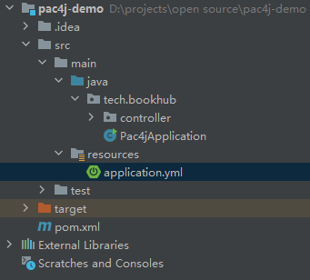

## 什么是 pac4j

pac4j 是一个简单而强大的安全框架，用于 Java 验证用户、获取用户配置文件和管理授权，以保护 web 应用程序和 web服务。

它提供了一套全面的概念和组件。它适用于大多数框架/工具，并支持大多数认证和授权机制。它的开源授权协议为 Apache 2。

在 Java Web 项目开发中，涉及到用户认证时，我们可以选用 pac4j 框架进行对接，以减少开发工作量。而由于 pac4j 本身支持了很多认证协议，如 OAuth2.0、OIDC、CAS、SAML2等，所以我们更倾向于，当我们的项目需要作为认证协议客户端，对接相应协议时使用 pac4j 框架，以减少对接工作量。

## pac4j 资料

pac4j 官方网站：[网站](https://www.pac4j.org)

pac4j 中文文档地址：[中文](https://pac4j.bookhub.tech/)

pac4j 英文文档地址：[英文](https://www.pac4j.org/docs/alldocs.html)

pac4j GitHub 地址：[GitHub](https://github.com/pac4j/pac4j)

pac4j 邮件列表：[邮件列表](https://www.pac4j.org/mailing-lists.html)

## 知识准备

阅读此 pac4j 新手指南，需要读者具有以下相关知识：

1. 基本的 Java 语言知识（包括 Java 8 中引入的 Lambda）
2. 会 Spring Boot 项目，并具有基本的 Spring Boot 项目知识
3. 常用 IDE 软件的使用经验，如 `IntelliJ IDEA`
4. Maven 基础知识（熟悉 Gradle 也可）

## pac4j 的版本

pac4j 目前分为三个主线版本，分别为：`4.X`、`5.X` 和 `6.X`，分别对应的 JDK 版本为：`JDK 8`、`JDK 11` 和 `JDK 17`。

使用时我们需要按照自己项目依赖的 JDK 版本进行选择。

## 相关软件、框架

指南将使用 `Spring Boot` 和 `Spring Security` 演示 pac4j 的使用，相关工具、软件、框架的版本如下表：

|软件/框架|版本号|
|--|--|
|`JDK`|`17.0.5`|
|`IntelliJ IDEA`|`社区版 2022.3.1`|
|`Maven`|`IntelliJ IDEA 内嵌`|
|`Spring Boot`|`2.7.7`|
|`Spring Security`|`2.7.7`|
|`pac4j`|`5.7.0`|

指南虽然使用 `JDK 17`，但选择 `Spring Boot` 版本为 `2.7.7`，pac4j 版本为 `5.7.0`。如果使用其他版本，需要注意相关的配套关系。

使用的框架版本中，如果存在 `Lombok` 依赖，还需要 IntelliJ IDEA 需要安装 `Lombok` 插件。

指南使用的是 IntelliJ IDEA 的社区版，不支持 `Spring Boot` 相关的开发特性，我们需要安装插件 `Spring Boot Assitant` 方便开发。如果你使用的是 IntelliJ IDEA 专业版，则无需安装此插件。

## 初始化项目

我们在 `IntelliJ IDEA` 中新建一个 Maven 项目，并修改 `pom.xml` 以适配 `Spring Boot`，构建一个使用 `Spring Boot` 和 `Spring Security` 的基础项目。

1. `pom.xml`：

```xml
<?xml version="1.0" encoding="UTF-8"?>
<project xmlns="http://maven.apache.org/POM/4.0.0"
         xmlns:xsi="http://www.w3.org/2001/XMLSchema-instance"
         xsi:schemaLocation="http://maven.apache.org/POM/4.0.0 http://maven.apache.org/xsd/maven-4.0.0.xsd">
    <modelVersion>4.0.0</modelVersion>
    <parent>
        <groupId>org.springframework.boot</groupId>
        <artifactId>spring-boot-starter-parent</artifactId>
        <version>2.7.7</version>
        <relativePath/>
    </parent>

    <groupId>tech.bookhub</groupId>
    <artifactId>pac4j-demo</artifactId>
    <version>1.0-SNAPSHOT</version>

    <name>pac4j-demo</name>
    <description>pac4j demo project for Spring Boot.</description>

    <properties>
        <java.version>17</java.version>
        <maven.compiler.source>17</maven.compiler.source>
        <maven.compiler.target>17</maven.compiler.target>
        <project.build.sourceEncoding>UTF-8</project.build.sourceEncoding>
    </properties>

    <dependencies>
        <dependency>
            <groupId>org.springframework.boot</groupId>
            <artifactId>spring-boot-starter-web</artifactId>
        </dependency>
        <dependency>
            <groupId>org.springframework.boot</groupId>
            <artifactId>spring-boot-starter-security</artifactId>
        </dependency>

        <dependency>
            <groupId>org.springframework.boot</groupId>
            <artifactId>spring-boot-starter-test</artifactId>
            <scope>test</scope>
        </dependency>
        <dependency>
            <groupId>org.springframework.security</groupId>
            <artifactId>spring-security-test</artifactId>
            <scope>test</scope>
        </dependency>
    </dependencies>

    <build>
        <plugins>
            <plugin>
                <groupId>org.springframework.boot</groupId>
                <artifactId>spring-boot-maven-plugin</artifactId>
            </plugin>
        </plugins>
    </build>

</project>
```

2. `application.yml`：

```yml
server:
  port: 8888

spring:
  security:
    user:
      name: admin
      password: bookhub
```

以上 `application.yml` 文件意图为：指定 tomcat 以端口 `8888` 运行，并配置一个用户 `admin`，密码为 `bookhub`。

3. `Pac4jApplication.java`：

```java
package tech.bookhub;

import org.springframework.boot.SpringApplication;
import org.springframework.boot.autoconfigure.SpringBootApplication;

@SpringBootApplication
public class Pac4jApplication {
    public static void main(String[] args) {
        SpringApplication.run(Pac4jApplication.class, args);
    }
}

```

4. `IndexController.java`：

```java
package tech.bookhub.controller;

import org.springframework.web.bind.annotation.GetMapping;
import org.springframework.web.bind.annotation.RestController;

@RestController
public class IndexController {

    @GetMapping("/")
    public String index() {
        return "index ok";
    }
}
```

项目结构如下图:



然后我们运行项目后，可以通过浏览器访问 [http://localhost:8888/](http://localhost:8888/)，首次访问将会跳转到 `Spring Security` 的默认认证界面，我们输入用户名 `admin`，密码 `bookhub`，如下图：


认证成功后，我们即可获得路径 `/` 的响应 `index ok`，如下图：


本篇 demo 内容见 GitHub，[Demo 0](https://github.com/dev2007/pac4j-beginner/tree/main/0/pac4j-demo)。
