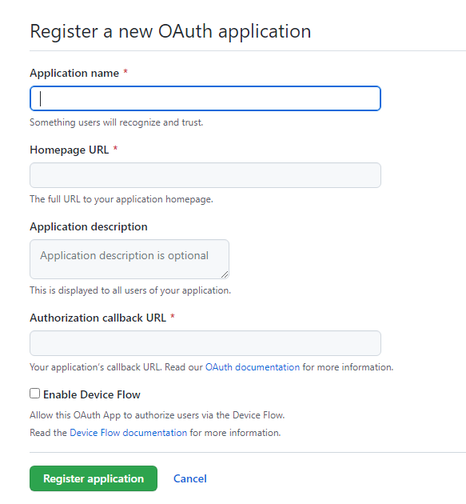
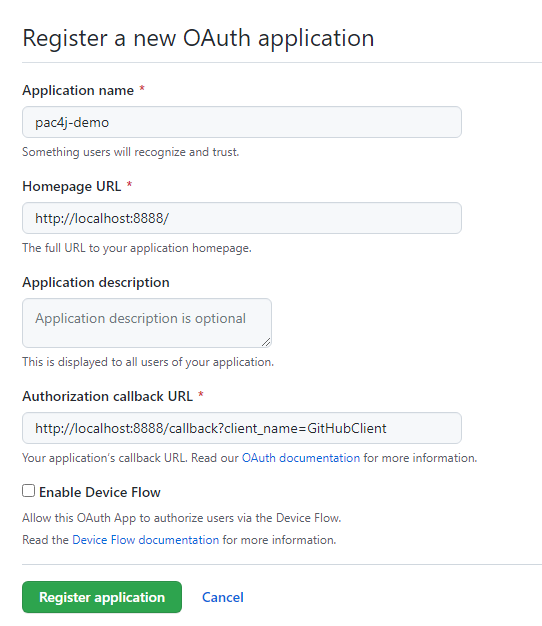
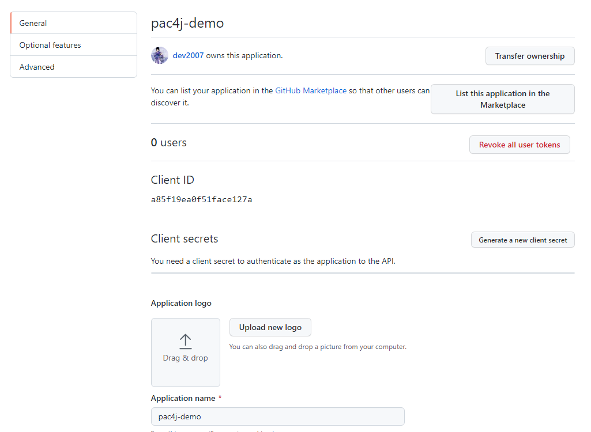
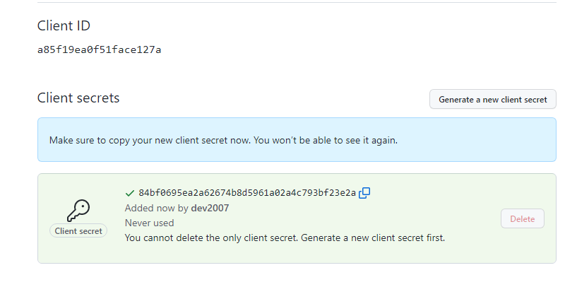
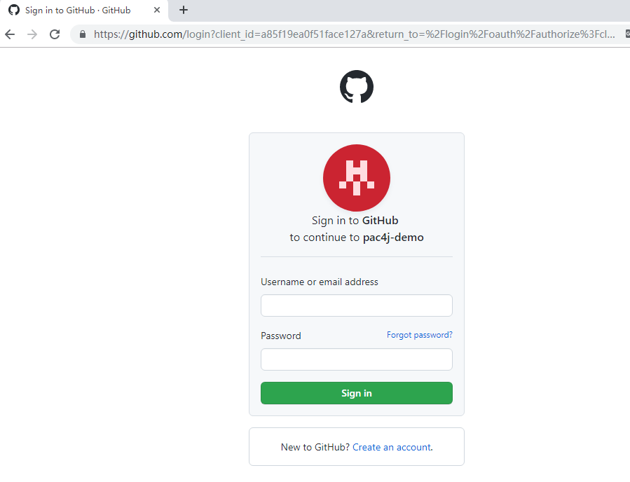
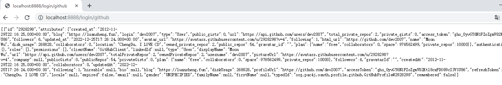

## 对接目标及 pac4j 依赖

我们以对接 `GitHub` 进行实战，能从项目指定路径 `/login/github` 跳转 `GitHub` 认证后，获取登录用户的相关信息在界面展示，其他 API 配置为不受此认证限定。

项目中采用 `Spring Security` 进行认证对接，并使用 JEE 相关的 Filter 实现认证、回调跳转，所以我们需要引入相关依赖 `spring-security-pac4j`，版本选择 `8.0.0`；引入 JEE 依赖  `javaee-pac4j`，版本选择 `7.1.0`。

然后我们需要引入 pac4j 核心依赖 `pac4j-core`，由于 `6.0.0` 版本还处于 `RC`，当前版本选择 `5.7.0`，同时，引入`pac4j-javaee`，以提供相关一些附加支持。（如果 `Spring Boot` 选择了 `3.0.1` 版本，将会引发 Tomcat 相关实现类的包名由 `javax` 变更为 `jakaraee`，`pac4j-javaee` 也要变更为 `pac4j-jakaratee`，但由于很多其他组件还没有提供相应的支持，不建议选择这个版本。）

我们以 OAuth2.0 协议为例，引入相应的依赖 `pac4j-oauth`，版本与 `pacj-core` 一致，为 `5.7.0`。

后面如果需要其他协议的对接，引入相应协议的依赖即可。

`pom.xml`：

```xml
<?xml version="1.0" encoding="UTF-8"?>
<project xmlns="http://maven.apache.org/POM/4.0.0"
         xmlns:xsi="http://www.w3.org/2001/XMLSchema-instance"
         xsi:schemaLocation="http://maven.apache.org/POM/4.0.0 http://maven.apache.org/xsd/maven-4.0.0.xsd">
    <modelVersion>4.0.0</modelVersion>
    <parent>
        <groupId>org.springframework.boot</groupId>
        <artifactId>spring-boot-starter-parent</artifactId>
        <version>2.7.7</version>
        <relativePath/>
    </parent>

    <groupId>tech.bookhub</groupId>
    <artifactId>pac4j-demo</artifactId>
    <version>1.0-SNAPSHOT</version>

    <name>pac4j-demo</name>
    <description>pac4j demo project for Spring Boot.</description>

    <properties>
        <java.version>17</java.version>
        <maven.compiler.source>17</maven.compiler.source>
        <maven.compiler.target>17</maven.compiler.target>
        <project.build.sourceEncoding>UTF-8</project.build.sourceEncoding>
        <spring-security-pac4j.version>8.0.0</spring-security-pac4j.version>
        <javaee-pac4j.version>7.1.0</javaee-pac4j.version>
        <pac4j.version>5.7.0</pac4j.version>
    </properties>

    <dependencies>
        <dependency>
            <groupId>org.springframework.boot</groupId>
            <artifactId>spring-boot-starter-web</artifactId>
        </dependency>
        <dependency>
            <groupId>org.springframework.boot</groupId>
            <artifactId>spring-boot-starter-security</artifactId>
        </dependency>

        <dependency>
            <groupId>org.pac4j</groupId>
            <artifactId>spring-security-pac4j</artifactId>
            <version>${spring-security-pac4j.version}</version>
        </dependency>
        <dependency>
            <groupId>org.pac4j</groupId>
            <artifactId>pac4j-javaee</artifactId>
            <version>${pac4j.version}</version>
        </dependency>
        <dependency>
            <groupId>org.pac4j</groupId>
            <artifactId>javaee-pac4j</artifactId>
            <version>${javaee-pac4j.version}</version>
        </dependency>

        <dependency>
            <groupId>org.pac4j</groupId>
            <artifactId>pac4j-core</artifactId>
            <version>${pac4j.version}</version>
        </dependency>
        <dependency>
            <groupId>org.pac4j</groupId>
            <artifactId>pac4j-oauth</artifactId>
            <version>${pac4j.version}</version>
        </dependency>


        <dependency>
            <groupId>org.springframework.boot</groupId>
            <artifactId>spring-boot-starter-test</artifactId>
            <scope>test</scope>
        </dependency>
        <dependency>
            <groupId>org.springframework.security</groupId>
            <artifactId>spring-security-test</artifactId>
            <scope>test</scope>
        </dependency>
    </dependencies>

    <build>
        <plugins>
            <plugin>
                <groupId>org.springframework.boot</groupId>
                <artifactId>spring-boot-maven-plugin</artifactId>
            </plugin>
        </plugins>
    </build>

</project>
```

## 服务端配置

OAuth2.0 协议，在客户端进行认证对接前，我们需要在服务端配置客户端相关信息，然后获取服务端为客户端分配的认证信息。

我们以 GitHub 为例。我们进入 GitHub 官网 [https://github.com/](https://github.com/)，登录账号后，点击网站右上角用户头像的下拉箭头，选择 “Settings”，进入设置界面，然后选择 “Developer settings”，最后选择 “OAuth Apps”，最终页面链接为 [https://github.com/settings/developers](https://github.com/settings/developers)。

我们点击“New OAuth App”，进入 OAuth 应用新建页面，如下图所示：



我们按要求填入相应信息，需要注意在 GitHub 中，“Homepage URL” 代表应用，即客户端的主页地址；“Authorization callback URL” 则代表服务端调用客户端的回调 url，如果客户端正式发布后，需要配置为客户端真实的访问地址，由于我们是在本地测试，所以我们都暂填写 `localhost` 作为访问地址即可。

|填写项|示例值|
|--|--|
|`Homepage URL`|`http://localhost:8888/`|
|`Authorization callback URL`|`http://localhost:8888/callback?client_name=GitHubClient`|

此处注意 `/callback?client_name=GitHubClient` 我们为 pac4j 默认的标准回调地址实现，在实际项目中，我们还可以自定义。

填写信息示例如下图：



填写好后，我们点击 “Register application”，完成客户端注册。然后我们得到 GitHub 作为服务端分配的认证信息，如下图所示：



我们记录下认证用信息 “Client ID”，然后点击 “Generate a new client secert”，生成一个 “Client Secret”，如下图所示：



我们再记录下 “Client secret”，用于客户端配置的认证信息就齐了。

## 添加认证接口

我们先创建一个新的 `LoginController` 类，用于实现触发登录认证的 API。

`LoginController.java`：

```java
package tech.bookhub.controller;

import org.pac4j.core.profile.UserProfile;
import org.pac4j.jee.context.JEEContext;
import org.pac4j.jee.context.session.JEESessionStore;
import org.pac4j.springframework.security.profile.SpringSecurityProfileManager;
import org.springframework.web.bind.annotation.GetMapping;
import org.springframework.web.bind.annotation.RestController;

import javax.servlet.http.HttpServletRequest;
import javax.servlet.http.HttpServletResponse;
import java.util.List;

@RestController
public class LoginController {
    @GetMapping("/login/github")
    public List<UserProfile> loginGithub(final HttpServletRequest request, final HttpServletResponse response) {
        final JEEContext jeeContext = new JEEContext(request, response);
        final SpringSecurityProfileManager profileManager = new SpringSecurityProfileManager(jeeContext, JEESessionStore.INSTANCE);
        return profileManager.getProfiles();
    }
}

```

API `/login/github` 的实现目标为：当认证通过后，此 API 响应登录到 GitHub 上的用户相关信息。

## 配置 pac4j

我们的项目作为客户端，需要配置 pac4j 以对接相应服务端的协议，由于服务端我们选择 GitHub 作为示例，那我们选择框架已实现的现成客户端 `GitHubClient` 进行配置。

我们先创建一个配置类，命名为 `Pac4jConfig`，并声明注解 `@Configuration`，然后在类中实现 pac4j `Config` 类的 Bean。

代码如下：

```java
package tech.bookhub.config;

import org.pac4j.core.config.Config;
import org.pac4j.oauth.client.GitHubClient;
import org.springframework.context.annotation.Bean;
import org.springframework.context.annotation.Configuration;

@Configuration
public class Pac4jConfig {

    @Bean
    public Config config() {
        GitHubClient gitHubClient = new GitHubClient("a85f19ea0f51face127a", "84bf0695ea2a62674b8d5961a02a4c793bf23e2a");

        Clients clients = new Clients("http://localhost:8888/callback",gitHubClient);
        Config config = new Config(clients);
        return config;
    }
}
```

代码中可以看到，在服务端配置中获得的 `Client ID` 和 `Client secret` 作为认证配置项，都传入了 `GitHubClient` 的构造函数。然后将生成的客户端对象传递给 `Config` 的构造函数。


## 配置 Security

指南未用 `Spring Security` 实现复杂的用户认证配置，仅用于 pac4j 的对接，所以我们先只关注认证的配置部分。

我们新建一个 `SecurityConfig` 类，用于存放相应的 `SecurityFilterChain` 的 Bean 定义，代码如下：

```java
package tech.bookhub.config;

import org.pac4j.core.config.Config;
import org.pac4j.jee.filter.CallbackFilter;
import org.pac4j.jee.filter.LogoutFilter;
import org.pac4j.jee.filter.SecurityFilter;
import org.pac4j.springframework.security.web.Pac4jEntryPoint;
import org.springframework.beans.factory.annotation.Autowired;
import org.springframework.context.annotation.Configuration;
import org.springframework.core.annotation.Order;
import org.springframework.security.config.annotation.web.builders.HttpSecurity;
import org.springframework.security.config.annotation.web.configuration.EnableWebSecurity;
import org.springframework.security.config.annotation.web.configuration.WebSecurityConfigurerAdapter;
import org.springframework.security.config.http.SessionCreationPolicy;
import org.springframework.security.web.authentication.www.BasicAuthenticationFilter;

@EnableWebSecurity
public class SecurityConfig {
    @Configuration
    @Order(1)
    public static class CallbackWebSecurityConfigurationAdapter extends WebSecurityConfigurerAdapter {
        @Autowired
        private Config config;

        @Autowired
        private Pac4jEntryPoint pac4jEntryPoint;

        protected void configure(final HttpSecurity http) throws Exception {
            http.antMatcher("/callback")
                    .addFilterBefore(new CallbackFilter(config), BasicAuthenticationFilter.class)
                    .csrf().disable();
        }
    }


    @Configuration
    @Order(2)
    public static class LogoutWebSecurityConfigurationAdapter extends WebSecurityConfigurerAdapter {
        @Autowired
        private Config config;

        protected void configure(final HttpSecurity http) throws Exception {
            final LogoutFilter logoutFilter = new LogoutFilter(config, "/?defaulturlafterlogout");
            logoutFilter.setDestroySession(true);

            http.antMatcher("/pac4jLogout")
                    .addFilterBefore(logoutFilter, BasicAuthenticationFilter.class)
                    .csrf().disable();
        }
    }

    @Configuration
    @Order(3)
    public static class GitHubAuthAdapter extends WebSecurityConfigurerAdapter {
        @Autowired
        private Config config;

        protected void configure(HttpSecurity http) throws Exception {
            final SecurityFilter filter = new SecurityFilter(config,"GitHubClient");

            http.antMatcher("/login/github")
                    .addFilterBefore(filter, BasicAuthenticationFilter.class)
                    .sessionManagement().sessionCreationPolicy(SessionCreationPolicy.ALWAYS);
        }
    }

    @Configuration
    @Order(4)
    public static class CommonAuthAdapter extends WebSecurityConfigurerAdapter {
        @Autowired
        private Config config;

        protected void configure(HttpSecurity http) throws Exception {
            http
                    .csrf().disable()
                    .authorizeRequests()
                    .antMatchers("/login/**").authenticated()
                    .anyRequest().permitAll();
        }
    }
}

```

以上代码中，我们通过使用 JEE 相应的 `SecurityFilter` 用于认证判定，跳转相应的认证服务端，使用 `CallbackFilter` 接受服务端的回调请求，使用 `LogoutFilter` 实现退出登录的请求。

我们运行项目，在浏览器输入 [http://localhost:8888/login/github](http://localhost:8888/login/github)，浏览器将跳转到 GitHub OAuth 认证界面，如下图：



我们输入自己的 GitHub 账号和密码，点击登录后，认证成功后，将会获得 `/login/github` 对应的响应数据，如下图：



如果我们在 `GitHubClient` 配置的 `Client ID`、`Client secret` 不匹配，在认证成功后将会进入报错页面，如下图：


本篇 demo 内容见 GitHub，[Demo 1](https://github.com/dev2007/pac4j-beginner/tree/main/1/pac4j-demo)。
