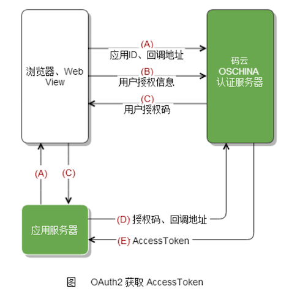

## 认证协议概述

我们常见的认证协议，包括 `OAuth`、`SAML`、`CAS` 和 `OpenID Connect` 等。在这些协议中，`OAuth` 协议只定义了基本的协议架构，但没有明确要求 API 如何指定，因而针对不同的协议提供厂商，需要开发不同的客户端进行对接。这些客户端最大的差异在于用户 API 响应的数据定义千差万别，所以自定义客户端最主要的实现是对用户数据的解析。

本篇我们以对接 Gitee 的 OAuth2.0 为例，实现自定义客户端。


## Gitee OAuth2.0 API

首先，我们先到 Gitee 官网，查看 OAuth2.0 相关 API 以及交互流程。Gitee 文档地址：[Gitee OAuth](https://gitee.com/api/v5/oauth_doc#/)。

交互流程见下图：



API 说明见下图：


然后我们到 API 文档中查找用户 API，如下图：


然后我们将 API 列在下表：

|用途|Http Method|API|
|--|--|--|
|获取 code（Authorization）|`GET`|`https://gitee.com/oauth/authorize?client_id={client_id}&redirect_uri={redirect_uri}&response_type=code`|
|获取 token（AccessToken）|`POST`|`https://gitee.com/oauth/token?grant_type=authorization_code&code={code}&client_id={client_id}&redirect_uri={redirect_uri}&client_secret={client_secret}`|
|用户数据|`GET`|`https://gitee.com/api/v5/user?access_token={access_token}`|

这里要特别注意一点，我们发现接口 `https://gitee.com/oauth/token` 的 Http Method 为 `POST`，但数据是以 URL 参数的形式传递的，这不符合常规设计，后续客户端代码开发时，不能依赖 pac4j 的基类实现，需要按框架其他方式实现这种 API 调用。

## 创建 OAuth2.0 应用

我们参照 GitHub 的方式，在 Gitee 官网上同样创建一个 OAuth2.0 应用。在登录官网后，点击右上角用户下拉，点击“设置”，然后找到“第三方应用”，最终的入口地址为 [第三方应用](https://gitee.com/oauth/applications)。

然后我们创建一个新应用，如下图：


类似于 GitHub，“应用回调地址”需要填写项目的回调地址，我们当前项目在本地运行，所以回调地址填写为 `http://localhost:8888/callback?client_name=GiteeClient`，`GiteeClient` 为后续我们定义的 pac4j 客户端名称。

应用创建后如下图：


## 创建客户端代码

因为 Gitee 与 GitHub 类似，所以我们参照 pac4j 中预置的 `GitHubClient` 进行开发。

### `GiteeAPI`

首先，我们定义 API 类 `GiteeApi`，继承基类 `DefaultApi20`，代码如下：

```java
package tech.bookhub.client.gitee;

import com.github.scribejava.apis.GitHubApi;
import com.github.scribejava.core.builder.api.DefaultApi20;
import com.github.scribejava.core.httpclient.HttpClient;
import com.github.scribejava.core.httpclient.HttpClientConfig;
import com.github.scribejava.core.oauth.OAuth20Service;

import java.io.OutputStream;

public class GiteeApi extends DefaultApi20 {
    protected GiteeApi() {
    }

    private static class InstanceHolder {
        private static final GiteeApi INSTANCE = new GiteeApi();
    }

    public static GiteeApi instance() {
        return GiteeApi.InstanceHolder.INSTANCE;
    }


    @Override
    public String getAccessTokenEndpoint() {
        return "https://gitee.com/oauth/token";
    }

    @Override
    public String getAuthorizationBaseUrl() {
        return "https://gitee.com/oauth/authorize";
    }

    @Override
    public OAuth20Service createService(String apiKey, String apiSecret, String callback, String defaultScope,
                                        String responseType, OutputStream debugStream, String userAgent, HttpClientConfig httpClientConfig,
                                        HttpClient httpClient) {
        return new GiteeService(this, apiKey, apiSecret, callback, defaultScope, responseType, userAgent, httpClientConfig, httpClient);
    }
}
```

在代码中 `getAccessTokenEndpoint` 和 `getAuthorizationBaseUrl` 为基类的抽象方法，用途为返回对应的 API。我们将 Gitee OAuth2.0 对应的 API 填写在此。

同时，我们参考 `GitHubClient`，将此类实现为单例。

另外，我们重载了方法 `createService`，并生成 `GiteeService` 类的对象，`GiteeService` 类在下面实现。

### `GiteeService`

接着，我们实现 `GiteeService` 类，继承自基类 `OAuth20Service`。我们主要重载 `createAccessTokenRequest` 方法，此方法将用于解决 Gitee 的 API `https://gitee.com/oauth/token` 使用 Http Method 方法为 `POST`，但参数却在 URL 参数中传递，这种非常规的实现。

如果按照常规实现，`POST` 方法中，数据以 `Request Body` 的形式传递，`GET` 方法中，数据以 URL 参数传递，那么我们不用实现此类，也不用在 `GiteeApi` 中重载 `createService` 方法，pac4j 框架的基类已经实现了常规实现的参数拼接。

代码如下：

```java
package tech.bookhub.client.gitee;

import com.github.scribejava.core.builder.api.DefaultApi20;
import com.github.scribejava.core.httpclient.HttpClient;
import com.github.scribejava.core.httpclient.HttpClientConfig;
import com.github.scribejava.core.model.OAuthConstants;
import com.github.scribejava.core.model.OAuthRequest;
import com.github.scribejava.core.oauth.AccessTokenRequestParams;
import com.github.scribejava.core.oauth.OAuth20Service;

import java.util.Map;

public class GiteeService extends OAuth20Service {
    public GiteeService(DefaultApi20 api, String apiKey, String apiSecret, String callback, String defaultScope,
                        String responseType, String userAgent, HttpClientConfig httpClientConfig, HttpClient httpClient) {
        super(api, apiKey, apiSecret, callback, defaultScope, responseType, null, userAgent, httpClientConfig, httpClient);
    }

    @Override
    protected OAuthRequest createAccessTokenRequest(AccessTokenRequestParams params) {
        final OAuthRequest request = new OAuthRequest(getApi().getAccessTokenVerb(), getApi().getAccessTokenEndpoint());

        getApi().getClientAuthentication().addClientAuthentication(request, getApiKey(), getApiSecret());

        request.addQuerystringParameter(OAuthConstants.CODE, params.getCode());
        final String callback = getCallback();
        if (callback != null) {
            request.addQuerystringParameter(OAuthConstants.REDIRECT_URI, callback);
        }
        final String scope = params.getScope();
        if (scope != null) {
            request.addQuerystringParameter(OAuthConstants.SCOPE, scope);
        } else if (getDefaultScope() != null) {
            request.addQuerystringParameter(OAuthConstants.SCOPE, getDefaultScope());
        }
        request.addQuerystringParameter(OAuthConstants.GRANT_TYPE, OAuthConstants.AUTHORIZATION_CODE);


        final Map<String, String> extraParameters = params.getExtraParameters();
        if (extraParameters != null && !extraParameters.isEmpty()) {
            for (Map.Entry<String, String> extraParameter : extraParameters.entrySet()) {
                request.addQuerystringParameter(extraParameter.getKey(), extraParameter.getValue());
            }
        }

        logRequestWithParams("access token", request);
        return request;
    }
}

```

在方法 `createAccessTokenRequest` 中，我们将基类中使用的 `request.addParameter` 修改为 `request.addQuerystringParameter`，以达到实现目的。

### `GiteeProfileDefinition`

在 pac4j 框架中，用户数据最终会以 `Profile` 类进行展示，所以我们需要定义客户端如何获取用户数据，并添加到相应  `Profile` 对象中。我们先实现定义，再实现客户端对应的 `Profile` 类本身。

代码如下：

```java
package tech.bookhub.client.gitee;

import com.github.scribejava.core.model.Token;
import org.pac4j.core.profile.ProfileHelper;
import org.pac4j.core.profile.converter.Converters;
import org.pac4j.oauth.config.OAuthConfiguration;
import org.pac4j.oauth.profile.JsonHelper;
import org.pac4j.oauth.profile.definition.OAuthProfileDefinition;

import java.util.Arrays;

import static org.pac4j.core.profile.AttributeLocation.PROFILE_ATTRIBUTE;

public class GiteeProfileDefinition extends OAuthProfileDefinition {
    public static final String URL = "url";
    public static final String FOLLOWING = "following";
    public static final String PUBLIC_REPOS = "public_repos";
    public static final String AVATAR_URL = "avatar_url";
    public static final String LOGIN = "login";
    public static final String NAME = "name";

    public GiteeProfileDefinition() {
        super(x -> new GiteeProfile());

        Arrays.asList(new String[]{
                NAME, LOGIN, URL, AVATAR_URL
        }).forEach(a -> primary(a, Converters.STRING));

        Arrays.asList(new String[]{
                FOLLOWING, PUBLIC_REPOS
        }).forEach(a -> primary(a, Converters.INTEGER));
    }

    @Override
    public String getProfileUrl(Token accessToken, OAuthConfiguration configuration) {
        return "https://gitee.com/api/v5/user";
    }

    @Override
    public GiteeProfile extractUserProfile(String body) {
        final var profile = (GiteeProfile) newProfile();
        final var json = JsonHelper.getFirstNode(body);
        if (json != null) {
            profile.setId(ProfileHelper.sanitizeIdentifier(JsonHelper.getElement(json, "id")));
            for (final var attribute : getPrimaryAttributes()) {
                convertAndAdd(profile, PROFILE_ATTRIBUTE, attribute, JsonHelper.getElement(json, attribute));
            }
        } else {
            raiseProfileExtractionJsonError(body);
        }
        return profile;
    }
}

```

重载方法 `getProfileUrl` 中，我们填写 Gitee 用户 API，用于获取用户数据。然后定义用户数据相关字段，并在构造函数中配置相应字段的转换方法。代码中作为示例，没有配置 Gitee 用户 API 响应的所有字段，仅配置了部分字段。

最后重载的方法 `extractUserProfile` 则为解析用户 API 数据后，如何转换为对应的 `Profile` 对象，下面将实现 `GiteeProfile`。

### `GiteeProfile`

`GiteeProfile` 类为用户数据获取的定义类，它继承基类 `OAuth20Profile`。

代码如下：

```java
package tech.bookhub.client.gitee;

import org.pac4j.oauth.profile.OAuth20Profile;

public class GiteeProfile extends OAuth20Profile {
    @Override
    public String getDisplayName() {
        return (String) getAttribute(GiteeProfileDefinition.NAME);
    }

    @Override
    public String getUsername() {
        return (String) getAttribute(GiteeProfileDefinition.LOGIN);
    }

    public Integer getFollowing() {
        return (Integer) getAttribute(GiteeProfileDefinition.FOLLOWING);
    }

    public Integer getPublicRepos() {
        return (Integer) getAttribute(GiteeProfileDefinition.PUBLIC_REPOS);
    }
}

```

### `GiteeClient`

最后，我们定义客户端类 `GiteeClient`，此类用于配置客户端要使用的 API 定义以及 Profile 数据解析。

代码如下：

```java
package tech.bookhub.client.gitee;

import org.pac4j.core.util.HttpActionHelper;
import org.pac4j.oauth.client.OAuth20Client;
import org.springframework.util.StringUtils;

import java.util.Optional;

public class GiteeClient extends OAuth20Client {
    public static final String DEFAULT_SCOPE = "user_info";

    public GiteeClient() {
        setScope(DEFAULT_SCOPE);
    }

    public GiteeClient(String key, String secret) {
        setScope(DEFAULT_SCOPE);
        setKey(key);
        setSecret(secret);
    }

    public GiteeClient(String key, String secret, String scope) {
        setScope(DEFAULT_SCOPE);
        setKey(key);
        setSecret(secret);
        setScope(scope);
    }

    @Override
    protected void internalInit(boolean forceReinit) {
        configuration.setApi(GiteeApi.instance());
        configuration.setProfileDefinition(new GiteeProfileDefinition());
        configuration.setTokenAsHeader(true);
        defaultLogoutActionBuilder((ctx, session, profile, targetUrl) ->
                Optional.of(HttpActionHelper.buildRedirectUrlAction(ctx, "https://gitee.com/logout")));

        super.internalInit(forceReinit);
    }

    public String getScope() {
        return getConfiguration().getScope();
    }

    public void setScope(String scope) {
        getConfiguration().setScope(StringUtils.hasText(scope) ? scope : DEFAULT_SCOPE);
    }
}

```

## 验证客户端

我们在之前的 `Pac4jConfig` 类中添加代码使用 `GiteeClient`。

代码如下：

```java
package tech.bookhub.config;

import org.pac4j.core.client.Clients;
import org.pac4j.core.config.Config;
import org.pac4j.oauth.client.GitHubClient;
import org.pac4j.springframework.security.web.Pac4jEntryPoint;
import org.springframework.context.annotation.Bean;
import org.springframework.context.annotation.Configuration;
import tech.bookhub.client.gitee.GiteeClient;

@Configuration
public class Pac4jConfig {

    @Bean
    public Config config() {
        GitHubClient gitHubClient = new GitHubClient("a85f19ea0f51face127a", "84bf0695ea2a62674b8d5961a02a4c793bf23e2a");

        GiteeClient giteeClient = new GiteeClient("da28980047eb2c732b8bcee4be567c6a4f38c6459587063f2607084c9c33b957",
                "4cd81eac1dae28b698044ed5b55e2580da94aca7d872e11e5b47d6c8a3b0a26d");

        Clients clients = new Clients("http://localhost:8888/callback", gitHubClient, giteeClient);
        Config config = new Config(clients);
        return config;
    }

    @Bean
    public Pac4jEntryPoint pac4jEntryPoint() {
        return new Pac4jEntryPoint(config(), "GitHubClient");
    }
}

```

然后在 `SecurityConfig` 类中配置相应的 url 匹配。

代码如下：

```java
    @Configuration
    @Order(4)
    public static class GiteeAuthAdapter extends WebSecurityConfigurerAdapter {
        @Autowired
        private Config config;

        protected void configure(HttpSecurity http) throws Exception {
            final SecurityFilter filter = new SecurityFilter(config,"GiteeClient");

            http.antMatcher("/login/gitee")
                    .addFilterBefore(filter, BasicAuthenticationFilter.class)
                    .sessionManagement().sessionCreationPolicy(SessionCreationPolicy.ALWAYS);
        }
    }
```

最后，在 `LoginController` 类中增加相应的 API。

代码如下：

```java
    @GetMapping("/login/gitee")
    public List<UserProfile> loginGitee(final HttpServletRequest request, final HttpServletResponse response) {
        final JEEContext jeeContext = new JEEContext(request, response);
        final SpringSecurityProfileManager profileManager = new SpringSecurityProfileManager(jeeContext, JEESessionStore.INSTANCE);
        return profileManager.getProfiles();
    }
```

我们运行项目，在浏览器中输入 [http://localhost:8888/login/gitee](http://localhost:8888/login/gitee)，将会跳转到 Gitee 认证界面，登录成功后，将会展示获取到的用户数据。如下图。


以上自定义客户端完成。

我们也提供了 pac4j 的 Gitee 客户端的开源组件，可以直接引用：

```xml
<dependency>
    <groupId>fun.mortnon.pac4j</groupId>
    <artifactId>oauth-gitee</artifactId>
    <version>1.0.0</version>
</dependency>
```

本篇 demo 内容见 GitHub，[Demo 2](https://github.com/dev2007/pac4j-beginner/tree/main/2/pac4j-demo)
